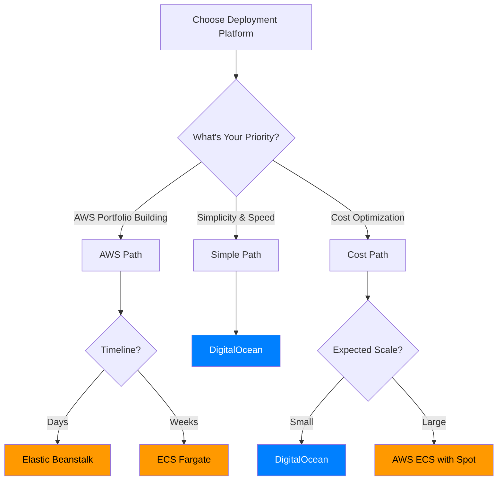
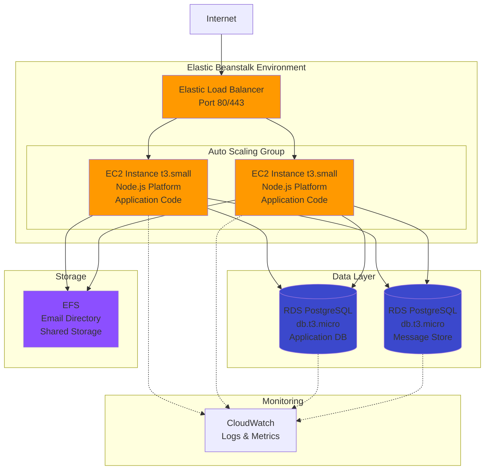
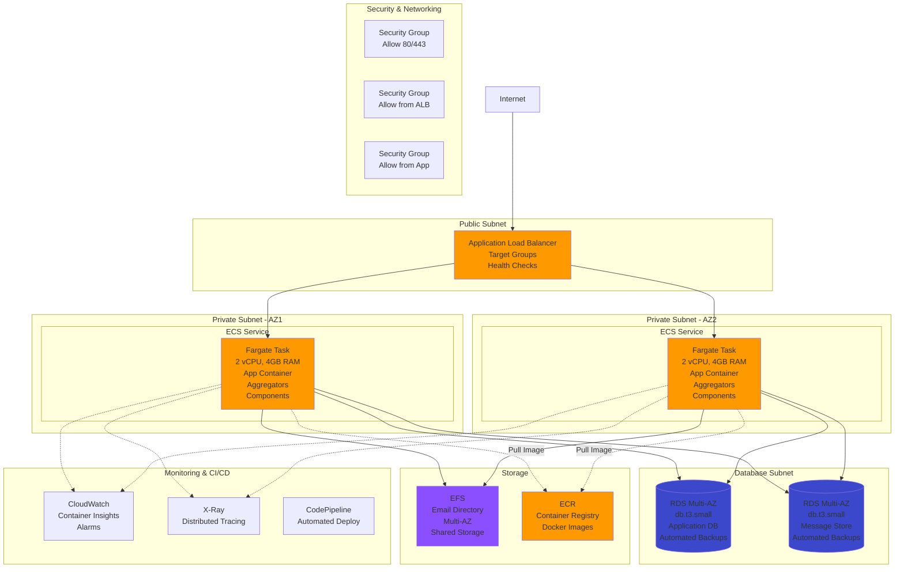
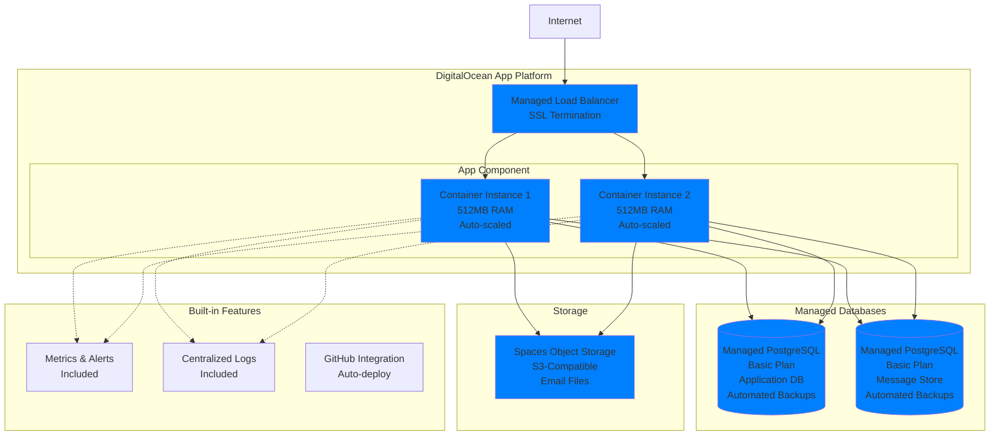
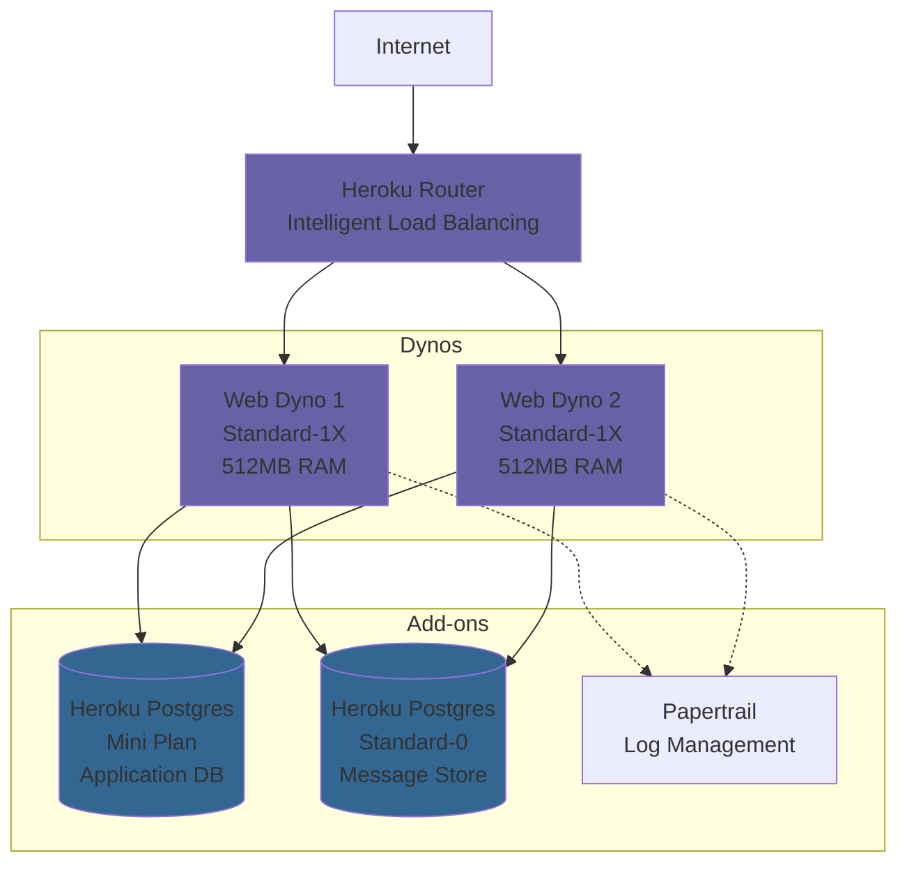
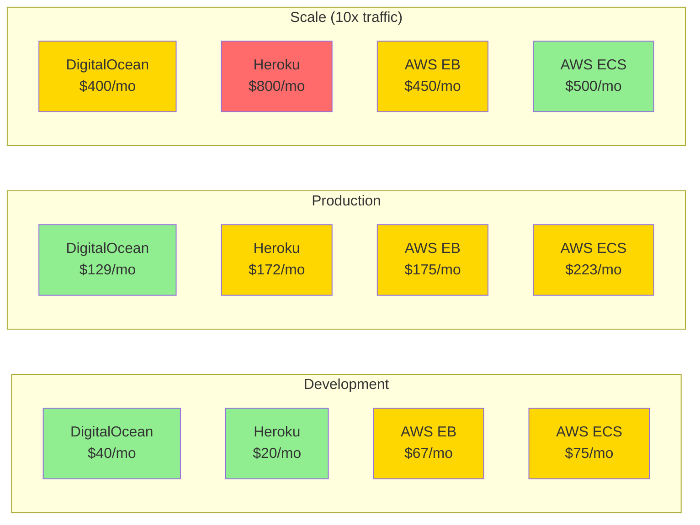
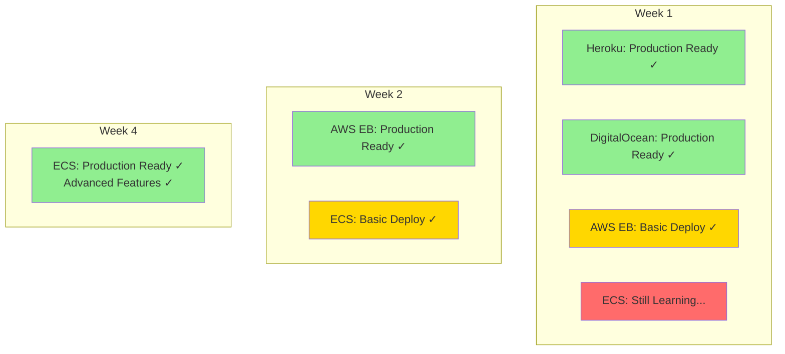
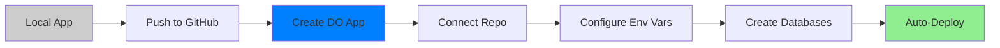

# Platform Comparison & Decision Guide

This guide provides a comprehensive comparison of deployment platforms for the Video Tutorials microservices application, with focus on AWS options, DigitalOcean, and Heroku alternatives.

## Table of Contents
- [Executive Summary](#executive-summary)
- [Architecture Comparison](#architecture-comparison)
- [Cost Analysis](#cost-analysis)
- [Complexity & Learning Curve](#complexity--learning-curve)
- [Use Case Recommendations](#use-case-recommendations)
- [Migration Paths](#migration-paths)

## Executive Summary

### Quick Recommendation Matrix



### Platform Score Card

| Criteria | AWS EB | AWS ECS | DigitalOcean | Heroku |
|----------|--------|---------|--------------|--------|
| **Setup Time** | ⭐⭐⭐⭐ | ⭐⭐⭐ | ⭐⭐⭐⭐⭐ | ⭐⭐⭐⭐⭐ |
| **AWS Portfolio Value** | ⭐⭐⭐⭐ | ⭐⭐⭐⭐⭐ | ⭐ | ⭐ |
| **Cost Efficiency** | ⭐⭐⭐ | ⭐⭐⭐⭐ | ⭐⭐⭐⭐⭐ | ⭐⭐ |
| **Scalability** | ⭐⭐⭐⭐ | ⭐⭐⭐⭐⭐ | ⭐⭐⭐ | ⭐⭐⭐⭐ |
| **Learning Curve** | ⭐⭐⭐ | ⭐⭐ | ⭐⭐⭐⭐⭐ | ⭐⭐⭐⭐⭐ |
| **Control/Flexibility** | ⭐⭐⭐ | ⭐⭐⭐⭐⭐ | ⭐⭐⭐ | ⭐⭐ |
| **Enterprise Ready** | ⭐⭐⭐⭐ | ⭐⭐⭐⭐⭐ | ⭐⭐⭐ | ⭐⭐⭐ |

## Architecture Comparison

### AWS Elastic Beanstalk Architecture



**Pros:**
- Managed platform updates and patching
- Built-in load balancing and auto-scaling
- Easy rollback and blue/green deployments
- Integrated CloudWatch monitoring
- Free tier eligible (pay for underlying resources)

**Cons:**
- Less control over infrastructure
- Can be more expensive than manual EC2
- Platform version constraints
- Harder to customize networking

**Best For:**
- Quick AWS deployments
- Teams familiar with PaaS (Heroku-like)
- Applications that fit standard patterns
- AWS SAA portfolio projects

### AWS ECS Fargate Architecture



**Pros:**
- True microservices orchestration
- No server management (serverless containers)
- Fine-grained resource control
- Excellent scaling capabilities
- Service mesh compatible
- Best AWS portfolio showcase

**Cons:**
- Steeper learning curve
- More complex setup
- Requires Docker knowledge
- More expensive at very small scale

**Best For:**
- Production microservices
- AWS architect portfolios
- Teams with container experience
- Applications needing precise control

### DigitalOcean App Platform Architecture



**Pros:**
- Simplest setup (GitHub deploy)
- Transparent, predictable pricing
- All-inclusive (monitoring, logs, SSL)
- Great for small-medium apps
- Excellent documentation
- No AWS complexity

**Cons:**
- Less flexibility than AWS
- Smaller ecosystem
- Geographic limitations
- Not as "impressive" for AWS portfolios
- Fewer advanced features

**Best For:**
- Rapid prototyping
- Cost-conscious projects
- Teams wanting simplicity
- Client recommendations (non-AWS)

### Heroku Architecture (For Reference)



**Pros:**
- Absolute simplest deployment (git push)
- Mature ecosystem (add-ons)
- Excellent developer experience
- Great documentation

**Cons:**
- **Billing complexity post-Salesforce**
- Expensive at scale ($7+/dyno)
- Less control
- Vendor lock-in
- Not cloud-agnostic

**Best For:**
- MVP/prototypes (if billing works)
- Teams prioritizing speed over cost
- **Note:** Billing became more complex for Heroku post-Salesforce acquisition

## Cost Analysis

### Monthly Cost Breakdown (Detailed)

#### AWS Elastic Beanstalk

**Development/Staging:**
```
EC2 Instance (t3.small)          $15-20/month
RDS PostgreSQL (db.t3.micro x2)  $25-30/month
Elastic Load Balancer            $16/month
EFS (5GB)                        $1.50/month
Data Transfer (50GB)             $4.50/month
CloudWatch                       $5/month
─────────────────────────────────────────────
Total                            ~$67-77/month
```

**Production (2 instances, larger DB):**
```
EC2 Instances (t3.small x2)      $30-40/month
RDS PostgreSQL (db.t3.small x2)  $60/month (Multi-AZ: +$60)
Elastic Load Balancer            $16/month
EFS (20GB)                       $6/month
Data Transfer (200GB)            $18/month
CloudWatch                       $10/month
─────────────────────────────────────────────
Total                            ~$140-210/month
```

**Cost Optimization Tips:**
- Use Reserved Instances (40% savings)
- Enable RDS backup retention optimization
- Use S3 instead of EFS for static files
- Implement CloudFront CDN for assets

#### AWS ECS Fargate

**Development/Staging:**
```
Fargate Tasks (0.5 vCPU, 1GB x2) $20-25/month
RDS PostgreSQL (db.t3.micro x2)  $25-30/month
Application Load Balancer        $16/month
EFS (5GB)                        $1.50/month
ECR Storage (5GB)                $0.50/month
Data Transfer                    $4.50/month
CloudWatch Container Insights    $7/month
─────────────────────────────────────────────
Total                            ~$75-85/month
```

**Production (with optimizations):**
```
Fargate Tasks (1 vCPU, 2GB x2)   $50/month
Fargate Spot (70% savings)       -$35/month
RDS Multi-AZ (db.t3.small x2)    $120/month
Application Load Balancer        $16/month
EFS (20GB)                       $6/month
ECR Storage                      $1/month
NAT Gateway                      $32/month
Data Transfer                    $18/month
CloudWatch + X-Ray               $15/month
─────────────────────────────────────────────
Total                            ~$223/month
```

**Cost Optimization Tips:**
- Use Fargate Spot for non-critical tasks (70% savings)
- Right-size containers (profile in dev first)
- Use AWS Compute Savings Plans
- Implement container image scanning to avoid waste

#### DigitalOcean App Platform

**Development/Staging:**
```
App (Basic, 512MB RAM)           $5/month
Managed PostgreSQL (Basic x2)    $30/month ($15 each)
Spaces (25GB)                    $5/month
Bandwidth (1TB included)         $0
─────────────────────────────────────────────
Total                            ~$40/month
```

**Production (scaled):**
```
App (Professional, 2GB RAM x2)   $24/month ($12 each)
Managed PostgreSQL (Prod x2)     $100/month ($50 each)
Spaces (250GB)                   $5/month
CDN (included)                   $0
Load Balancer (included)         $0
SSL (included)                   $0
─────────────────────────────────────────────
Total                            ~$129/month
```

**Cost Optimization Tips:**
- No optimization needed - pricing is flat
- Includes bandwidth, SSL, monitoring
- Predictable scaling costs

#### Heroku (For Comparison)

**Development/Staging:**
```
Eco Dynos (2 x $5)               $10/month
Postgres Mini (x2)               $10/month
Papertrail (Free tier)           $0
SSL (included)                   $0
─────────────────────────────────────────────
Total                            ~$20/month
```

**Production:**
```
Standard Dynos (2 x $25)         $50/month
Postgres Standard-0 (x2)         $100/month
Papertrail                       $7/month
Redis (optional)                 $15/month
────────────────────────────────────────────
Total                            ~$172/month
```

**Note:** Heroku eliminated free tier after acquisition by SalesForce

### Cost Comparison Graph



### Value Analysis for Technical Teams

For teams evaluating platform investments:

**AWS Elastic Beanstalk:**
- Investment: $67/month dev + ~10 hours setup
- Technical Depth: Medium (managed platform with AWS flexibility)
- Team Skill Requirements: Basic cloud knowledge, some AWS familiarity
- **Best for:** Teams needing AWS integration without deep container expertise

**AWS ECS Fargate:**
- Investment: $75/month dev + ~40 hours initial setup
- Technical Depth: High (production-grade container orchestration)
- Team Skill Requirements: Container experience, networking, security knowledge
- **Best for:** Organizations requiring enterprise-grade architecture and control

**DigitalOcean:**
- Investment: $40/month + ~5 hours setup
- Technical Depth: Low (fully managed PaaS)
- Team Skill Requirements: Minimal - standard web development
- **Best for:** Startups prioritizing speed-to-market over infrastructure control

## Complexity & Learning Curve

### Setup Time Estimates

```mermaid
gantt
    title Time to First Deployment
    dateFormat X
    axisFormat %H hours

    section DigitalOcean
    Setup Account        :0, 1h
    Configure App        :1h, 2h
    Deploy              :2h, 1h
    Total 3 hours       :milestone, 3h, 0h

    section Elastic Beanstalk
    Setup AWS Account    :0, 2h
    Configure EB CLI     :2h, 1h
    Create RDS          :3h, 2h
    Deploy & Test       :5h, 3h
    Total 8 hours       :milestone, 8h, 0h

    section ECS Fargate
    Setup AWS           :0, 2h
    Dockerize App       :2h, 4h
    Configure ECS       :6h, 6h
    Setup Networking    :12h, 3h
    Deploy Pipeline     :15h, 5h
    Total 20 hours      :milestone, 20h, 0h

    section Heroku
    Setup Account       :0, 1h
    Git Push Deploy     :1h, 1h
    Total 2 hours       :milestone, 2h, 0h
```

### Skills Required Matrix

| Skill Area | AWS EB | AWS ECS | DigitalOcean | Heroku |
|------------|--------|---------|--------------|--------|
| **Linux/CLI** | Medium | High | Low | Low |
| **Networking** | Medium | High | Low | None |
| **Docker** | None | High | Optional | None |
| **IaC (Terraform)** | Optional | Medium | None | None |
| **Security (IAM)** | Medium | High | Low | None |
| **Monitoring** | Medium | High | Low | Low |
| **Cost Management** | Medium | High | Low | Low |

### Learning Curve Visualization



## Use Case Recommendations

### Scenario 1: Building Technical Expertise

**Recommended Learning Path:**
1. **Start:** AWS Elastic Beanstalk (Week 1)
2. **Advance:** AWS ECS Fargate (Weeks 2-3)
3. **Compare:** DigitalOcean (Week 4)

**Rationale:**
- EB provides foundation in AWS managed services
- ECS builds advanced container orchestration skills
- DigitalOcean demonstrates multi-cloud competency
- Complete architecture understanding across platforms

**Documentation Opportunities:**
- Platform migration case studies with metrics
- Cost optimization strategies and results
- Architecture decision records (ADRs)
- Infrastructure-as-code implementations

### Scenario 2: Startup MVP (Speed Priority)

**Recommended:** DigitalOcean App Platform

**Rationale:**
- Fastest time to market
- Predictable costs for investor pitches
- Easy to manage pre-product-market-fit
- Can migrate to AWS later with growth

### Scenario 3: Enterprise Migration

**Recommended:** AWS ECS Fargate

**Rationale:**
- Compliance requirements (VPC, security groups)
- Integration with existing AWS services
- Advanced monitoring and observability
- Multi-region capability

### Scenario 4: Cost-Sensitive Projects

**Recommended:** DigitalOcean or AWS EB (depending on requirements)

**Evaluation Criteria:**
- Pure cost optimization: DigitalOcean
- AWS ecosystem needs: Elastic Beanstalk
- Predictable billing: DigitalOcean
- Future AWS service integration: Elastic Beanstalk

**Decision Framework:**
Compare both platforms with proof-of-concept deployments to evaluate:
- Actual monthly costs at expected scale
- Development team productivity
- Operations overhead
- Migration costs if platform change needed

## Migration Paths

### Heroku → AWS Elastic Beanstalk


**Effort:** 1-2 days
**Risk:** Low (similar platform model)
**Cost Change:** -30% to -50%

### Elastic Beanstalk → ECS Fargate


**Effort:** 3-5 days
**Risk:** Medium (architecture change)
**Benefit:** Better scaling, cost optimization, portfolio value

### Local Development → DigitalOcean



**Effort:** 2-4 hours
**Risk:** Very Low
**Cost:** Most affordable

## Decision Framework

### Choose AWS Elastic Beanstalk If:
- ✅ The organization already uses AWS services
- ✅ Heroku-like simplicity needed with AWS power
- ✅ Standard web application patterns fit the architecture
- ✅ Team has basic AWS knowledge
- ❌ Advanced microservices orchestration required

### Choose AWS ECS Fargate If:
- ✅ True microservices architecture needed
- ✅ Building for production scale and reliability
- ✅ Container orchestration experience on team
- ✅ Compliance requires fine-grained infrastructure control
- ✅ Cost optimization critical (Fargate Spot available)
- ❌ Need deployment in <1 day

### Choose DigitalOcean If:
- ✅ Simplicity and speed prioritized over complexity
- ✅ Predictable, transparent pricing required
- ✅ Building MVPs or proof-of-concepts
- ✅ Limited DevOps resources
- ❌ AWS-specific service integrations needed
- ❌ Enterprise compliance requirements (HIPAA, SOC2)

### Avoid Heroku If:
- ✅ Billing complexity is a concern
- ✅ Cost optimization is a priority
- ✅ More infrastructure control needed

## Implementation Recommendations

Choose the platform that aligns with business and technical requirements:

### For Quick Market Validation
**Deploy to DigitalOcean App Platform**
- Follow the [DigitalOcean guide](./digitalocean.md)
- Fastest path to production
- Lowest infrastructure overhead
- **Time investment:** ~4 hours
- **Best for:** MVPs, proof-of-concepts

### For AWS-Centric Organizations
**Deploy to AWS Elastic Beanstalk**
- Follow the [Elastic Beanstalk guide](./elastic-beanstalk.md)
- Integrates with existing AWS services
- Managed platform reduces DevOps burden
- **Time investment:** ~8 hours
- **Best for:** Teams already using AWS, Heroku migrations

### For Enterprise Production Workloads
**Deploy to AWS ECS Fargate**
- Follow the [ECS Fargate guide](./ecs-fargate.md)
- Production-grade container orchestration
- Advanced deployment strategies
- Fine-grained cost optimization
- **Time investment:** ~20-30 hours
- **Best for:** Microservices at scale, compliance requirements

## Conclusion

For organizations evaluating deployment platforms:

**Primary Recommendation:** Choose based on specific constraints and team capabilities rather than following a one-size-fits-all approach.

Consider:
- ✅ Current team skills and infrastructure experience
- ✅ Existing cloud provider relationships
- ✅ Budget constraints and cost predictability needs
- ✅ Time-to-market requirements
- ✅ Compliance and security requirements
- ✅ Expected scale and growth trajectory

Ready to start? Head to the appropriate deployment guide based on the decision framework above.
